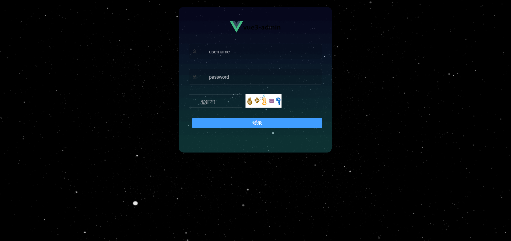
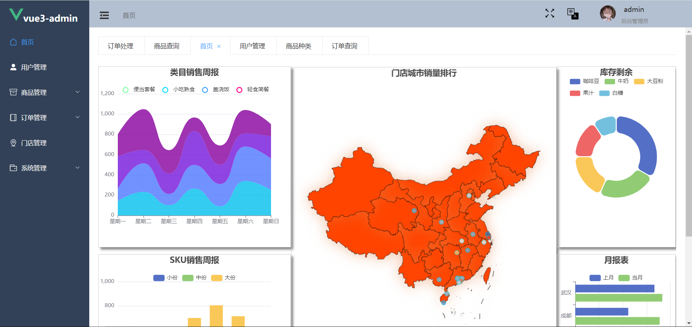
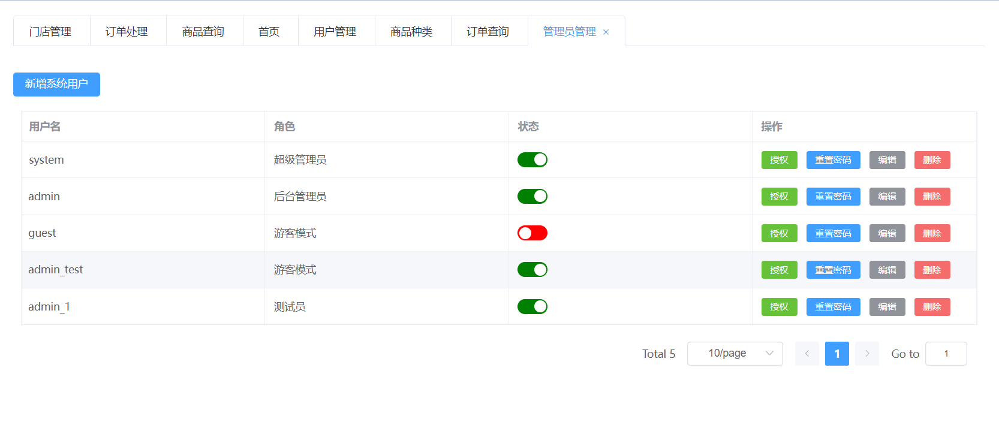
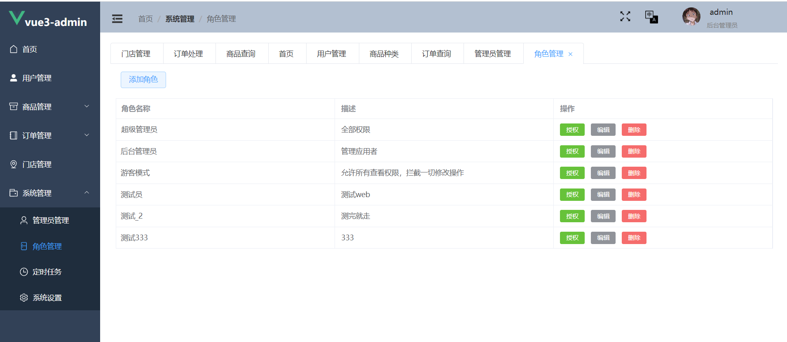
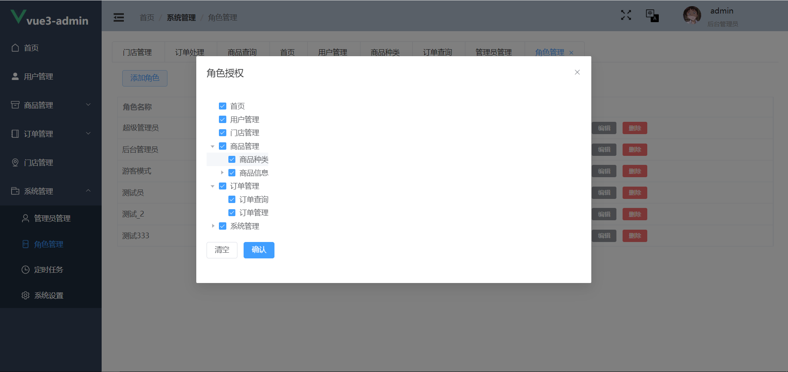
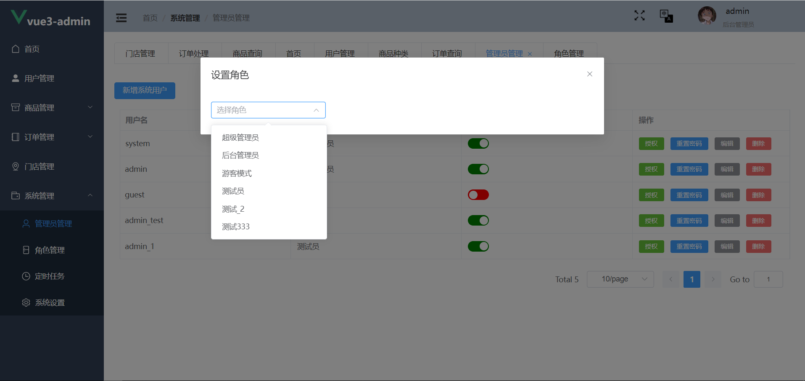
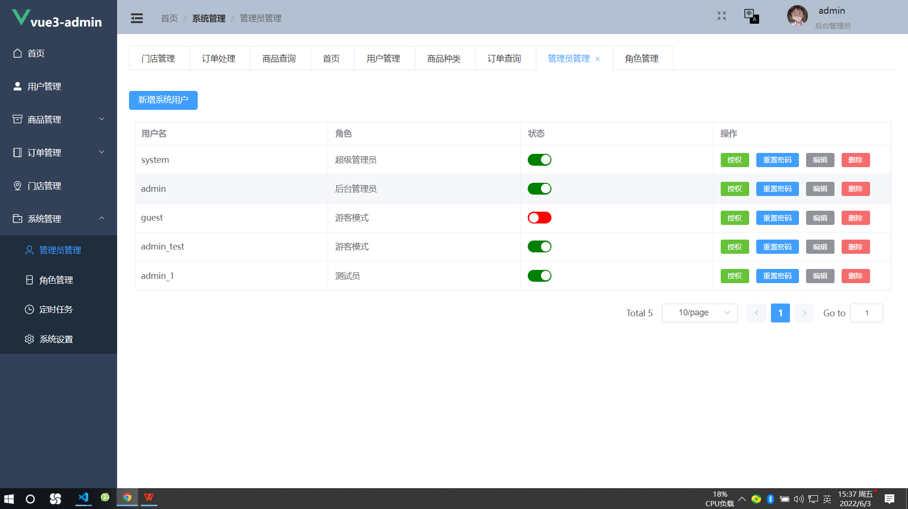
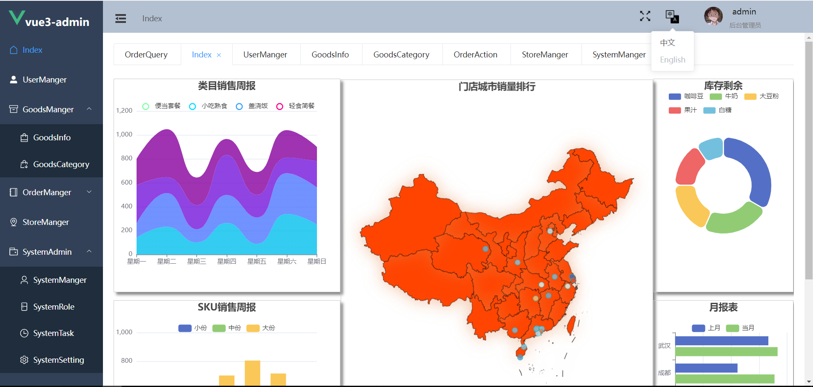

# vue3-admin
基于vue3.2(setup)+ts+vite+vueRouter4.x+vuex4.x+axios+element-Plus+echarts数据可视化+RBAC(权限管理)搭建的后台管理系统
**项目启动**
`yarn`
`yarn dev`

**项目预览**

登录页

首页:

管理员:

角色管理:

添加角色授权

设置角色

全屏

中英文切换

